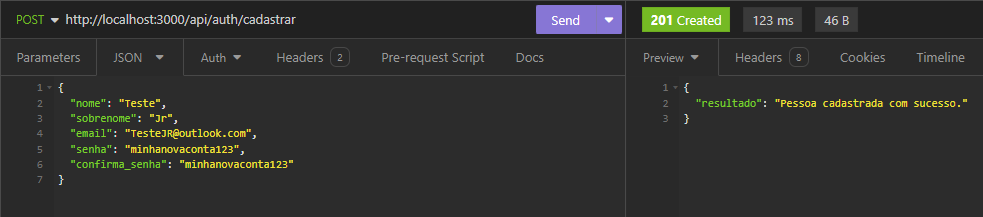
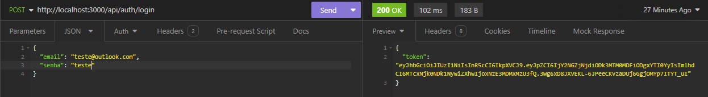
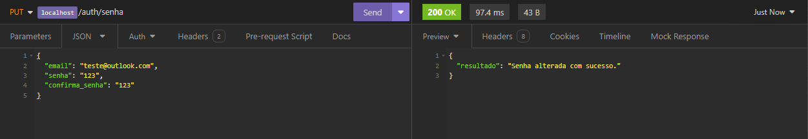
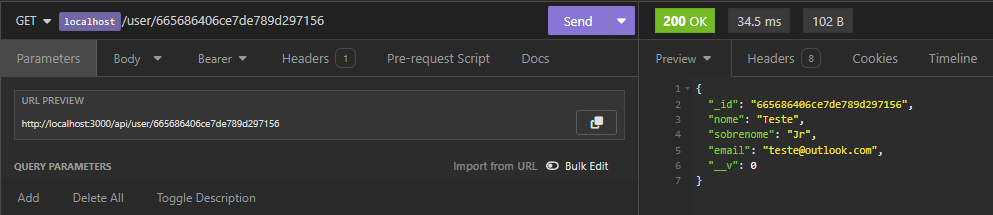
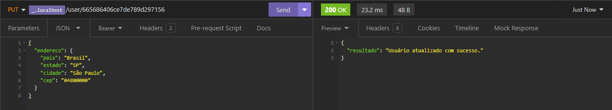
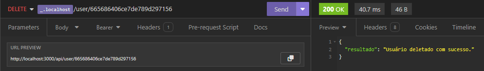

<h1>Projeto Integrador 2DM - GymRats</h1>

<h1>Tecnologias utilizadas</h1>
<strong>Node.js</strong> - v20.10.0 
<strong>Express</strong> - v4.19.2 
<strong>Mongoose</strong> - v8.3.2 
<strong>bcrypt</strong> - v5.1.1 
<strong>JSON Web Token</strong> - v9.0.2

<h1>Requisitos</h1>
<strong>npm</strong> - v10.2.3

<h1>Utilização</h1>
<ol>
  <li>Clone esse repositório: <code>git clone https://github.com/sntpwbl/projeto-integrador-2dm.git</code></li> 
  <li>Navegue até o diretório gerado: <code>cd projeto-integrador-2dm</code></li> 
  <li>Instale as dependências da API: <code>npm install</code></li> 
  <li>Crie uma pasta com o nome 'config' e dentro dela um arquivo '.env'. Dentro do arquivo, crie duas variáveis:  1) MONGODB_STRING (use a string de conexão com seu banco Mongo)  2) SECRET (crie uma string que servirá como o secret de seus tokens)</li> 
  <li>Inicie o servidor: <code>npm start</code></li>
</ol>

<h1>Rotas</h1>

<strong>POST /auth/cadastrar</strong>: Cadastra um novo usuário no sistema: 

<strong>POST /auth/login</strong>: Retorna um token de acesso baseado no secret da aplicação caso os dados do usuário estejam corretos. Este token contém o ID do usuário dentro do banco: 

<strong>PATCH /auth/senha</strong>: Altera a senha de um usuário cadastrado no sistema: 
   

<strong>GET /user/:id</strong>: Retorna os dados relacionados à um usuário: 

<strong>PATCH /user/:id</strong>: Atualiza dados específicos de um usuário: 

Apesar da imagem mostrar uma requisição PUT, use PATCH.

<strong>DELETE /user/:id</strong>: Deleta usuário do sistema: 

<h1>Observações</h1>
<ol>
  <li>Todas as rotas <strong>/api/user/:id</strong> vão requerir um <strong>token</strong> para serem executadas com sucesso. Você pode armazenar o token do usuário no armazenamento local ou em memória para utilizá-lo nessas requisições. Envie-o pelo
    cabeçalho da requisição no campo 'Authorization';</li>
  <li>Os tokens emitidos na rota de login contém o <strong>id</strong> do usuário. Descriptografe o token (recomendação: jwt-decode) e abstraia o valor do id para usá-lo nas rotas. Ainda assim é necessário enviar o token na requisição. O token enviado na requisição deve conter o id usado nos parâmetros da rota.</li>
</ol>
